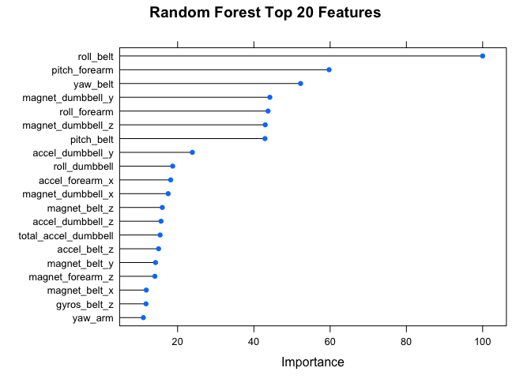
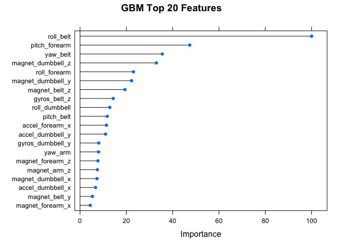

# Are you lifting your weights correctly ?


#### Abstract

Human activity recognition, based on sensor collected data, is a vibrant research area. In this analysis, a large dataset is used to create predictive models that use sensor data to classify how well a particular wight lifting exercise is executed.  Random Forest and Generalized Boosting Regression Models are created, and their accuracy examined.  Models with 52 and 24 features are examined.  Finally, a Random Forest model with 24 predictors is chosen.  The accuracy of this model against a validation dataset is **99.25%**.  The predictions on the test data were 100% accurate.

#### Exploring the data

A weight lifting exercise [dataset](http://groupware.les.inf.puc-rio.br/har) was used to conduct this analysis.  The data were collected from 6 healthy, young participants.  Each of the participants was asked to perform the Unilateral Dumbbell Biceps Curl in five different fashions - exactly according to specification (Class A),throwing the elbows to the front (Class B), lifting the dumbbell only halfway(Class C), lowering the dumbbell only halfway (Class D), and throwing the hips to the front (Class D).  Sensorsinstalled on each participant included (a) a belt sensor, (b) a forearm sensor, (c) and arm sensor,and (d) a dumbbell sensor.  The objective is to use the sensor-generated data to classify the 
bicep curl as one of the 5 defined classes.

The "training" data includes about 200,000 measurements, and the testing data includes 20 measurements.
Each measurement consists of 160 features.  However, upon closer examination it was discovered that 
data were not available for a significant number of variables.  Removing the features with a significant number of "NA" entries, reduced the number of features from 160 to just about 60.  A few features
related to date/timestamp of measurement were removed from the dataset - this is because the 
intent is to create a model that can classify activity based on sensor measured data, regardless of date/timestamp. New training and testing sets were created containing (a) user name, (b) 52 sensor measurements with no NA values, and (c) class of activity


```r
download.file("https://d396qusza40orc.cloudfront.net/predmachlearn/pml-training.csv", destfile = "pmltrng.csv")
training=read.csv("pmltrng.csv")
download.file("https://d396qusza40orc.cloudfront.net/predmachlearn/pml-testing.csv", destfile = "pmltest.csv")
testing=read.csv("pmltest.csv")

tt<-lapply(1:160, function (x) sum(is.na(testing[,x])/length(testing[,x]))) # Find columns with NA values 
newtrn<-training[,-c(which(tt!=0))] # Only keep columns that have no NAs in both training and testing sets
newtrn<-newtrn[,-c(1,3:7)] # Remove non-features, like date, timsestamp etc.
newtst<-testing[,-c(which(tt!=0))]
newtst<-newtst[,-c(1,3:7)]
names(newtrn)
```

```
##  [1] "user_name"            "roll_belt"            "pitch_belt"          
##  [4] "yaw_belt"             "total_accel_belt"     "gyros_belt_x"        
##  [7] "gyros_belt_y"         "gyros_belt_z"         "accel_belt_x"        
## [10] "accel_belt_y"         "accel_belt_z"         "magnet_belt_x"       
## [13] "magnet_belt_y"        "magnet_belt_z"        "roll_arm"            
## [16] "pitch_arm"            "yaw_arm"              "total_accel_arm"     
## [19] "gyros_arm_x"          "gyros_arm_y"          "gyros_arm_z"         
## [22] "accel_arm_x"          "accel_arm_y"          "accel_arm_z"         
## [25] "magnet_arm_x"         "magnet_arm_y"         "magnet_arm_z"        
## [28] "roll_dumbbell"        "pitch_dumbbell"       "yaw_dumbbell"        
## [31] "total_accel_dumbbell" "gyros_dumbbell_x"     "gyros_dumbbell_y"    
## [34] "gyros_dumbbell_z"     "accel_dumbbell_x"     "accel_dumbbell_y"    
## [37] "accel_dumbbell_z"     "magnet_dumbbell_x"    "magnet_dumbbell_y"   
## [40] "magnet_dumbbell_z"    "roll_forearm"         "pitch_forearm"       
## [43] "yaw_forearm"          "total_accel_forearm"  "gyros_forearm_x"     
## [46] "gyros_forearm_y"      "gyros_forearm_z"      "accel_forearm_x"     
## [49] "accel_forearm_y"      "accel_forearm_z"      "magnet_forearm_x"    
## [52] "magnet_forearm_y"     "magnet_forearm_z"     "classe"
```

####Model Selection

Two models were created to predict class of activity based on sensor data.  One model used a Random Forests (RF) algorithm, and the second used a Generalized Boosted Regression approach (GBM).

The training data set was itself split two sets - one for training, and the second as a validation set
to examine out-of-sample performance.  The testing set was reserved for final predictions.

In training the models, 10-fold cross validation was employed.  10-fold was chosen as a first attempt,
with other approaches to be explored if there was desire to further increase the accuracy.  Given the
relatively large size of the data set, it was expected that 3-fold or leave-one-out cross-validation would consume more computing resources.  After the models were trained, predictions were made on the validation set. The accuracies were **99.49% for RF** and **96.15% for GBM**.


```r
library(caret)

set.seed(3233)
inTrain = createDataPartition(newtrn$classe, p = 3/4)[[1]] 
newtrntrn = newtrn[ inTrain,]
newtrnval = newtrn[-inTrain,]
```


```r
rfmodel<-train(classe~.,method="rf",data=newtrntrn, trControl=trainControl(method="cv",number=10))
```


```r
set.seed(3233)
gbmmodel<-train(classe~.,method="gbm",data=newtrntrn, verbose=FALSE,trControl=trainControl(method="cv",number=10))
```


```r
rfval<-predict(rfmodel,newtrnval) #RF prediction on validation set
print(paste("Accuracy of RF Model on Validation Set (%):  ",round(100*sum(rfval==newtrnval$classe)/length(rfval),2))) # Accuracy of RF prediction on validation set
```

```
## [1] "Accuracy of RF Model on Validation Set (%):   99.47"
```

```r
gbmval<-predict(gbmmodel,newtrnval) # GBM prediction on validation set
print(paste("Accuracy of GBM Model on Validation Set:  ",round(100*sum(gbmval==newtrnval$classe)/length(gbmval),2))) # Accuracy of GBM prediction on validation set
```

```
## [1] "Accuracy of GBM Model on Validation Set:   96.15"
```

In the next step, the importance of the predictors was examined.  The top 20 variables of importance
in the RF and GBM models were identified.  A significant overlap was observed, though the top 20 variables were not identical.  


```r
# Plot Top 20 features by importance
plot(varImp(rfmodel),20,main="Random Forest Top 20 Features")
```



```r
plot(varImp(gbmmodel),20,main="GBM Top 20 Features")
```



Four predictors in the top 20 for RF were not in the GBM model and vice versa.  The lists were combined to create a short list of 24 predictors.  New training, validation, and test sets were created with this smaller feature list.


```r
library(caret)
# Feature selection - Top 20 from RF and GBM
 
ImpMeasure<-data.frame(varImp(rfmodel)$importance)
ImpMeasure$Vars<-row.names(ImpMeasure)
top20rf<-ImpMeasure[order(-ImpMeasure$Overall),][1:20,] # Top 20 for RF

ImpMeasure<-data.frame(varImp(gbmmodel)$importance)
ImpMeasure$Vars<-row.names(ImpMeasure)
top20gbm<-ImpMeasure[order(-ImpMeasure$Overall),][1:20,] # Top 20 for GBM

top24feats<-c(top20rf$Vars,top20gbm$Vars[which(!top20gbm$Vars%in%top20rf$Vars)]) # Merge the two top 20 lists

# Create new testing, training, validation sets with smaller number of features
tf24trn<-training[,top24feats]
tf24trn$classe<-training$classe

tf24tst<-testing[,top24feats]
tf24tst$classe<-testing$classe

set.seed(3233)
inTrain = createDataPartition(tf24trn$classe, p = 3/4)[[1]] 
tf24trntrn = tf24trn[ inTrain,]
tf24trnval = tf24trn[-inTrain,]
names(tf24trn)
```

```
##  [1] "roll_belt"            "pitch_forearm"        "yaw_belt"            
##  [4] "magnet_dumbbell_y"    "roll_forearm"         "magnet_dumbbell_z"   
##  [7] "pitch_belt"           "accel_dumbbell_y"     "roll_dumbbell"       
## [10] "accel_forearm_x"      "magnet_dumbbell_x"    "magnet_belt_z"       
## [13] "accel_dumbbell_z"     "total_accel_dumbbell" "accel_belt_z"        
## [16] "magnet_belt_y"        "magnet_forearm_z"     "magnet_belt_x"       
## [19] "gyros_belt_z"         "yaw_arm"              "gyros_dumbbell_y"    
## [22] "magnet_arm_z"         "accel_dumbbell_x"     "magnet_forearm_x"    
## [25] "classe"
```

The modeling exercise (using RF, GBM, and 10-fold cross-validation) was completed with this smaller feature set. Predictions on the validation set yielded accuracies of **99.25% for RF** and **96% for GBM**.


```r
set.seed(3233)
rf24model<-train(classe~.,method="rf",data=tf24trntrn, trControl=trainControl(method="cv",number=10))
```


```r
rf24val<-predict(rf24model,tf24trnval)
print (paste("Accuracy on validation set, RF with 24 features (%):  ",round(100*sum(rf24val==tf24trnval$classe)/length(rf24val),2)))
```

```
## [1] "Accuracy on validation set, RF with 24 features (%):   99.25"
```

```r
confusionMatrix(rf24val,tf24trnval$classe)$table
```

```
##           Reference
## Prediction    A    B    C    D    E
##          A 1395    8    0    0    0
##          B    0  935    4    0    0
##          C    0    6  847   13    1
##          D    0    0    4  791    1
##          E    0    0    0    0  899
```


```r
set.seed(3233)
gbm24model<-train(classe~.,method="gbm",data=tf24trntrn, verbose=FALSE,trControl=trainControl(method="cv",number=10))
```


```r
gbm24val<-predict(gbm24model,tf24trnval)
print(paste("Accuracy on validation set, GBM with 24 features (%):  ",round(100*sum(gbm24val==tf24trnval$classe)/length(gbm24val),2)))
```

```
## [1] "Accuracy on validation set, GBM with 24 features (%):   96"
```

```r
confusionMatrix(gbm24val,tf24trnval$classe)$table
```

```
##           Reference
## Prediction    A    B    C    D    E
##          A 1375   30    0    1    0
##          B   15  882   26    2   19
##          C    3   32  815   21    7
##          D    2    5   14  774   13
##          E    0    0    0    6  862
```


#### Conclusion

The RF model give higher prediction accuracy, and the shorter feature list did not lead to a drop in the 
accuracy of the predictions.  Therefore, the RF model with 24 features was selected as the final model for the test data.  The predictions on the test data were 100% accurate (as confirmed by the answers to Quiz 4).


